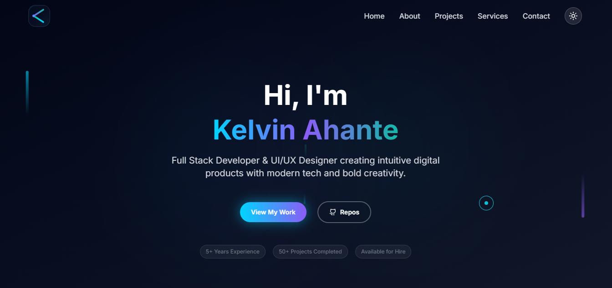

# 🚀 Kelvin Ahante - Full Stack Developer Portfolio

A modern, responsive portfolio website showcasing my expertise in full-stack development, UI/UX design, and digital solutions. Built with cutting-edge technologies and featuring interactive animations, dynamic content, and a professional design aesthetic.



## ✨ Features

### 🎨 **Modern Design**
- **Apple-level aesthetics** with meticulous attention to detail
- **Glassmorphism effects** with backdrop blur and transparency
- **Gradient color schemes** using custom primary, secondary, and accent colors
- **Dark/Light theme** toggle with smooth transitions
- **Responsive design** optimized for all devices

### 🎭 **Interactive Animations**
- **Framer Motion** powered animations and micro-interactions
- **Particle.js** background with interactive particles
- **Parallax scrolling** effects for immersive experience
- **Custom cursor** with hover state changes
- **Smooth scroll** navigation between sections

### 📱 **Core Sections**
- **Hero Section** - Dynamic introduction with animated background
- **About Me** - Skills showcase with animated progress bars
- **Featured Projects** - Interactive project gallery with filtering
- **Services** - Comprehensive service offerings with testimonials
- **Contact Form** - Functional contact form with EmailJS integration

### 🛠 **Technical Features**
- **TypeScript** for type safety and better development experience
- **Tailwind CSS** for utility-first styling
- **React Hooks** for state management
- **Intersection Observer** for scroll-triggered animations
- **Form validation** with React Hook Form
- **Email integration** with EmailJS
- **Performance optimized** with lazy loading and code splitting

## 🏗 **Tech Stack**

### **Frontend**
- **React 18** - Modern React with hooks and concurrent features
- **TypeScript** - Type-safe JavaScript for better development
- **Vite** - Fast build tool and development server
- **Tailwind CSS** - Utility-first CSS framework

### **Animations & UI**
- **Framer Motion** - Production-ready motion library
- **Lucide React** - Beautiful, customizable icons
- **@tsparticles** - Interactive particle backgrounds
- **React Intersection Observer** - Scroll-triggered animations

### **Forms & Communication**
- **React Hook Form** - Performant forms with easy validation
- **EmailJS** - Send emails directly from the frontend

### **Development Tools**
- **ESLint** - Code linting and quality assurance
- **PostCSS** - CSS processing and optimization
- **Autoprefixer** - Automatic vendor prefixing

## 🚀 **Getting Started**

### **Prerequisites**
- Node.js 18+ 
- npm or yarn package manager

### **Installation**

1. **Clone the repository**
   ```bash
   git clone https://github.com/kiviekelvin/developer-portfolio.git
   cd developer-portfolio
   ```

2. **Install dependencies**
   ```bash
   npm install
   # or
   yarn install
   ```

3. **Start development server**
   ```bash
   npm run dev
   # or
   yarn dev
   ```

4. **Open in browser**
   ```
   http://localhost:5173
   ```

### **Build for Production**
```bash
npm run build
# or
yarn build
```

### **Preview Production Build**
```bash
npm run preview
# or
yarn preview
```

## 📧 **Email Configuration**

The contact form uses EmailJS for sending emails. To set up:

1. **Create EmailJS account** at [emailjs.com](https://www.emailjs.com/)
2. **Configure email service** (Gmail, Outlook, etc.)
3. **Create email template** with the provided structure
4. **Update credentials** in `src/services/emailService.ts`:
   ```typescript
   const EMAILJS_SERVICE_ID = 'your_service_id';
   const EMAILJS_TEMPLATE_ID = 'your_template_id';
   const EMAILJS_PUBLIC_KEY = 'your_public_key';
   ```

Detailed setup instructions are available in `src/utils/emailSetup.md`.

## 🎨 **Customization**

### **Colors**
Update the color scheme in `tailwind.config.js`:
```javascript
colors: {
  primary: '#00D4FF',    // Cyan blue
  secondary: '#8B5CF6',  // Purple
  accent: '#14B8A6',     // Teal
  dark: {
    50: '#1E293B',       // Dark blue-gray
    100: '#0F172A',      // Darker blue-gray
    200: '#020617',      // Darkest blue-gray
  }
}
```

### **Content**
- **Personal information**: Update in respective components
- **Projects**: Modify the projects array in `src/components/Projects.tsx`
- **Services**: Update services data in `src/components/Services.tsx`
- **About section**: Edit content in `src/components/About.tsx`

### **Animations**
- **Particle settings**: Configure in `src/components/Hero.tsx`
- **Animation timings**: Adjust in individual component files
- **Scroll triggers**: Modify intersection observer thresholds

## 📁 **Project Structure**

```
src/
├── components/          # React components
│   ├── About.tsx       # About section with skills
│   ├── Contact.tsx     # Contact form with validation
│   ├── CustomCursor.tsx # Custom cursor component
│   ├── Footer.tsx      # Footer with social links
│   ├── Hero.tsx        # Hero section with particles
│   ├── Logo.tsx        # Animated logo component
│   ├── Navbar.tsx      # Navigation with theme toggle
│   ├── Projects.tsx    # Project showcase with filtering
│   ├── ScrollProgress.tsx # Scroll progress indicator
│   ├── Services.tsx    # Services and testimonials
│   ├── TestimonialsSlider.tsx # Client testimonials
│   └── Toast.tsx       # Toast notifications
├── context/            # React context providers
│   ├── ThemeContext.tsx # Dark/light theme management
│   └── ToastContext.tsx # Toast notification system
├── services/           # External service integrations
│   └── emailService.ts # EmailJS integration
├── utils/              # Utility files and documentation
│   └── emailSetup.md   # Email setup instructions
├── App.tsx             # Main application component
├── main.tsx           # Application entry point
└── index.css          # Global styles and Tailwind imports
```

## 🌟 **Featured Projects**

### **1. Child Immunisation Record System (CIRS)**
- **Tech**: React, TypeScript, Tailwind CSS, Supabase
- **Description**: Comprehensive healthcare management system
- **Live**: [View Project](https://charming-pixie-366189.netlify.app/)

### **2. EduSync Student Portal**
- **Tech**: HTMX, CSS, JavaScript, Firebase
- **Description**: Modern educational platform with analytics
- **Live**: [View Project](https://admirable-cactus-b63fb7.netlify.app/)

### **3. Wiseview Legal Consultancy**
- **Tech**: WordPress, Figma, jQuery, CSS
- **Description**: Professional legal services website
- **Live**: [View Project](https://wiseviewlegal.com/)

*[View all projects in the portfolio]*

## 🤝 **Contributing**

Contributions, issues, and feature requests are welcome! Feel free to check the [issues page](https://github.com/kiviekelvin/developer-portfolio/issues).

### **Development Guidelines**
1. **Fork the repository**
2. **Create a feature branch** (`git checkout -b feature/amazing-feature`)
3. **Commit changes** (`git commit -m 'Add amazing feature'`)
4. **Push to branch** (`git push origin feature/amazing-feature`)
5. **Open a Pull Request**

## 📄 **License**

This project is licensed under the MIT License - see the [LICENSE](LICENSE) file for details.

## 📞 **Contact**

**Kelvin Ahante** - Full Stack Developer & UI/UX Designer

- **Email**: [kelvinkivie@gmail.com](mailto:kelvinkivie@gmail.com)
- **Phone**: +234 906 658 8231
- **LinkedIn**: [linkedin.com/in/kelvin-ahante](https://www.linkedin.com/in/kelvin-ahante/)
- **GitHub**: [github.com/kiviekelvin](https://github.com/kiviekelvin)
- **Portfolio**: [Live Demo](https://kiviekelvin.github.io/my-portfolio-website/)

## 🙏 **Acknowledgments**

- **Design Inspiration**: Apple's design philosophy and modern web trends
- **Icons**: [Lucide React](https://lucide.dev/) for beautiful, consistent icons
- **Images**: [Pexels](https://www.pexels.com/) for high-quality stock photography
- **Animations**: [Framer Motion](https://www.framer.com/motion/) for smooth animations
- **Particles**: [tsParticles](https://particles.js.org/) for interactive backgrounds

---

<div align="center">

**⭐ Star this repository if you found it helpful!**

Made with ❤️ and lots of ☕ by [Kelvin Ahante](https://github.com/kiviekelvin)

</div>